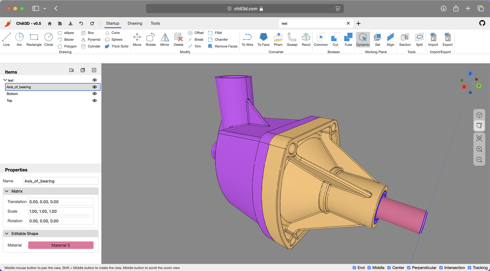

# Chili3D

A web-based 3D CAD application for online model design and editing.



## Overview

[Chili3D](https://chili3d.com) is an [open-source](https://github.com/xiangechen/chili3d), browser-based 3D CAD (Computer-Aided Design) application built with TypeScript. It achieves near-native performance by compiling OpenCascade (OCCT) to WebAssembly and integrating with Three.js, enabling powerful online modeling, editing, and rendering—all without the need for local installation.

You can access Chili3D online at:

- Official website: [chili3d.com](https://chili3d.com)
- Cloudflare deployment: [chili3d.pages.dev](https://chili3d.pages.dev)

## Features

### Modeling Tools

- **Basic Shapes**: Create boxes, cylinders, cones, spheres, pyramids, and more
- **2D Sketching**: Draw lines, arcs, circles, ellipses, rectangles, polygons, and Bezier curves
- **Advanced Operations**:
    - Boolean operations (union, difference, intersection)
    - Extrusion and revolution
    - Sweeping and lofting
    - Offset surfaces
    - Section creation

### Snapping and Tracking

- **Object Snapping**: Precisely snap to geometric features (points, edges, faces)
- **Workplane Snapping**: Snap to the current workplane for accurate planar operations
- **Axis Tracking**: Create objects along tracked axes for precise alignment
- **Feature Point Detection**: Automatically detect and snap to key geometric features
- **Tracking Visualization**: Visual guides showing tracking lines and reference points

### Editing Tools

- **Modification**: Chamfer, fillet, trim, break, split
- **Transformation**: Move, rotate, mirror
- **Advanced Editing**:
    - Feature removal
    - Sub-shape manipulation
    - Explode compound objects

### Measurement Tools

- Measure angles and lengths
- Calculate the sum of length, area, and volume

### Document Management

- Create, open, and save documents
- Full undo/redo stack with transaction history
- Import/export of industry-standard formats (STEP, IGES, BREP)

### User Interface

- Office-style interface with contextual command organization
- Hierarchical assembly management with flexible grouping capabilities
- Dynamic workplane support
- 3D viewport with camera controls
- Camera position recall

### Localization

- **Multi-Language Interface**: Built-in internationalization (i18n) supporting seamless adaptation to global user bases
- **Current Languages**: Chinese & English; contributions for additional languages are welcome

## Technology Stack

- **Frontend**: TypeScript, Three.js
- **3D Engine**: OpenCascade (via WebAssembly)
- **Build Tools**: Rspack
- **Testing**: Jest

## Change Log

You can view the full change log [here](https://github.com/xiangechen/chili3d/releases).

For Chinese users, you can also browse the [media](https://space.bilibili.com/539380032/lists/3108412?type=season).

## Getting Started

### Prerequisites

- Node.js
- npm

### Installation

1. Clone the repository

    ```bash
    git clone https://github.com/xiangechen/chili3d.git
    cd chili3d
    ```

2. Install dependencies

    ```bash
    npm install
    ```

### Development

Start the development server:

```bash
npm run dev # Launches at http://localhost:8080
```

### Building

Build the application:

```bash
npm run build
```

### Building wasm

if you want to build wasm by yourself, you can use the following commands:

1. Set up WebAssembly dependencies(if you have not installed them yet)

    ```bash
    npm run setup:wasm
    ```

2. Build the WebAssembly module:

    ```bash
    npm run build:wasm
    ```

## Development Status

⚠️ **Early Development Notice**

Chili3D is currently in active alpha development. Key considerations:

- Core APIs may undergo breaking changes
- Essential features are under implementation
- Documentation is being progressively developed

## Contributing

We welcome contributions in the form of code, bug reports, or feedback. Please feel free to submit pull requests or open issues.

## Contact

- **Discussions**: Join our [GitHub discussions](https://github.com/xiangechen/chili3d/discussions) for general chat or questions
- **Issues**: Use [GitHub issues](https://github.com/xiangechen/chili3d/issues) to report public suggestions or bugs
- **Email**: Contact us privately at xiangetg@msn.cn

## License

Distributed under the GNU Affero General Public License v3.0 (AGPL-3.0). For commercial licensing options, contact xiangetg@msn.cn

Full license details: [LICENSE](LICENSE)
