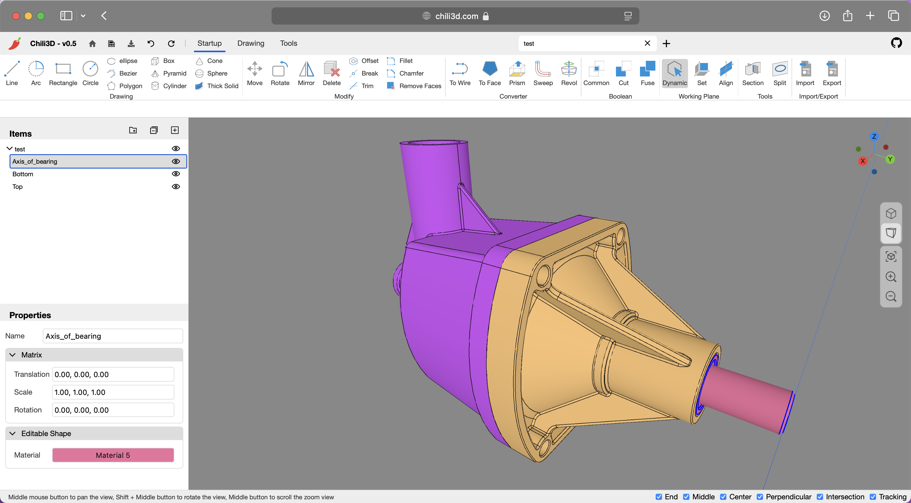

# Chili3D

A browser-based 3D CAD application for online model design and editing.



## Overview

[Chili3D](https://chili3d.com) is an [open-source](https://github.com/xiangechen/chili3d) browser-based 3D CAD (Computer-Aided Design) application built with TypeScript. It achieves near-native performance by compiling OpenCascade (OCCT) to WebAssembly and integrating with Three.js, enabling powerful online modeling, editing, and rendering — all without requiring local installation.

You can access Chili3D online at:

- Official website: [chili3d.com](https://chili3d.com)
- Cloudflare deployment: [chili3d.pages.dev](https://chili3d.pages.dev)

## Features

### Modeling Tools

- **Basic Shapes**: Create boxes, cylinders, cones, spheres, pyramids, torus, and more
- **2D Sketching**: Draw lines, arcs, circles, ellipses, rectangles, polygons, and Bézier curves
- **Advanced Operations**:
    - Boolean operations (union, difference, intersection)
    - Extrusion and revolution
    - Sweeping and lofting
    - Offset surfaces and thick solid
    - Linear and circular arrays
    - Shape checking and repair

### Snapping and Tracking

- **Object Snapping**: Precisely snap to geometric features (points, edges, faces)
- **Workplane Snapping**: Snap to the current workplane for accurate planar operations
- **Axis Tracking**: Create objects along tracked axes for precise alignment
- **Feature Point Detection**: Automatically detect and snap to key geometric features
- **Tracking Visualization**: Visual guides showing tracking lines and reference points

### Editing Tools

- **Modification**: Chamfer, fillet, trim, break, split, sew, simplify
- **Transformation**: Move, rotate, mirror, linear array, circular array
- **Advanced Editing**:
    - Feature removal
    - Sub-shape manipulation
    - Explode compound objects

### Measurement Tools

- Measure angles and lengths
- Calculate the sum of length, area, and volume

### Document Management

- Create, open, and save documents
- Full undo/redo stack with transaction history
- Import/export of industry-standard formats (STEP, IGES, BREP, STL)

### User Interface

- Office-style ribbon interface with contextual command organization
- Hierarchical assembly management with flexible grouping capabilities
- Dynamic workplane support
- 3D viewport with camera controls and camera position recall
- Command context panel integrated into the viewport

### Plugin System

Chili3D supports a runtime plugin system with dynamic loading via URL parameters (`?plugin=`). Example plugins include:

- **helloworld-js** / **helloworld-ts** — Demo plugins showcasing the plugin API
- **macro** — Create, edit, and run macros to automate repetitive tasks
- **visual-programming** — Visual programming with a node-based editor (powered by Rete.js)

### Localization

- **Multi-Language Support**: Built-in internationalization (i18n) with seamless locale switching
- **Current Languages**: Chinese (zh-cn), English (en), Portuguese — Brazil (pt-br)
- Contributions for additional languages are welcome

## Architecture

Chili3D uses an npm workspace monorepo under `packages/` with an interface-driven, pluggable backend architecture:

```
web ──> builder ──> app ──> core
                  ──> i18n ──> core
                  ──> three ──> core
                  ──> ui ──> core + element
                  ──> wasm ──> core
                  ──> storage ──> core

element ──> core
```

- **`core`** — Abstract interfaces (`IShape`, `IShapeFactory`), math (`XYZ`, `Matrix4`, `Plane`), document model, reactive data (`Observable`, `Binding`, `PubSub`), `Result<T,E>`, transactions/undo/redo, commands, serialization, plugin system, service container, UI abstractions
- **`wasm`** — Concrete `ShapeFactory` calling into OCCT via Emscripten bindings
- **`three`** — Three.js viewport, camera controller, visual objects, highlighter, outline pass, gizmo, mesh export
- **`element`** — Custom reactive DOM elements (radio groups, expanders, data converters)
- **`ui`** — Application chrome: main window, ribbon/toolbar, property panels, project tree, dialogs, toast, status bar
- **`app`** — Concrete `Application`, body node classes, command implementations, `CommandService`, `HotkeyService`
- **`builder`** — `AppBuilder` with a fluent `.useIndexedDB().useWasmOcc().useThree().useUI().build()` chain and default ribbon layout
- **`i18n`** — Locale data (en, zh-cn, pt-br)
- **`storage`** — IndexedDB persistence layer
- **`web`** — Entry point: calls `AppBuilder`, shows loading screen, parses URL parameters

## Technology Stack

- **Frontend**: TypeScript, Three.js (0.184)
- **3D Kernel**: OpenCascade 8.0.0 (OCCT) compiled to WebAssembly via Emscripten
- **Bundler**: Rspack 2
- **Linting & Formatting**: Biome (TypeScript), clang-format (C++)
- **Testing**: Rstest + Happy-DOM
- **Package Manager**: npm workspaces

## Changelog

You can view the full changelog [here](https://github.com/xiangechen/chili3d/releases).

For Chinese users, you can also browse the [media](https://space.bilibili.com/539380032/lists/3108412?type=season).

## Getting Started

### Prerequisites

- Node.js
- npm

### Installation

1. Clone the repository

    ```bash
    git clone https://github.com/xiangechen/chili3d.git
    cd chili3d
    ```

2. Install dependencies

    ```bash
    npm install
    ```

### Development

Start the development server:

```bash
npm run dev   # Launches at http://localhost:8080
```

### Building

Build the application:

```bash
npm run build
```

### WASM Build (Optional)

The prebuilt WASM module is included in the repository. If you want to build it from source:

1. Set up WebAssembly dependencies (one-time setup):

    ```bash
    npm run setup:wasm
    ```

2. Build the WebAssembly module:

    ```bash
    npm run build:wasm
    ```

### Testing & Linting

```bash
npm run test    # Run all tests (Rstest + Happy-DOM)
npm run testc   # Tests with coverage
npm run check   # Biome lint + auto-fix
npm run format  # Biome + clang-format across all files
```

### Docker

You can also deploy with Docker:

```bash
docker compose up -d   # Builds and serves the app at http://localhost:8080
```

## Code Style

- **TypeScript**: Biome for linting and formatting — 4-space indent, 110-char line width, double quotes, semicolons always
- **C++**: clang-format with WebKit style
- Interfaces prefixed with `I` (`IShape`, `ICommand`)
- `camelCase` functions/variables, `PascalCase` classes, `UPPER_SNAKE_CASE` constants
- Type-only imports: `import type { IFoo } from "..."`
- Pre-commit hooks via simple-git-hooks + lint-staged

## Contributing

We welcome contributions! Please feel free to submit pull requests or open issues.

Before submitting a PR, run `npm run check` to ensure your code passes linting.

## Contact

- **Discussions**: Join our [GitHub discussions](https://github.com/xiangechen/chili3d/discussions) for general chat or questions
- **Issues**: Use [GitHub issues](https://github.com/xiangechen/chili3d/issues) to report suggestions or bugs
- **Email**: Contact us privately at xiangetg@msn.cn

## License

Distributed under the GNU Affero General Public License v3.0 (AGPL-3.0). For commercial licensing options, contact xiangetg@msn.cn.

Full license details: [LICENSE](LICENSE)

The C++ WASM module (`cpp/`) is licensed under LGPL-3.0.

## Analytics Notice

Chili3D uses [Microsoft Clarity](https://clarity.microsoft.com) for growth analytics. To disable data collection, remove the Clarity script from `public/index.html`.

## Disclaimer

This software is provided "AS IS," and the authors and contributors hereby disclaim all express and implied warranties. The user shall bear full responsibility for any and all risks and potential consequences arising from the use of this software. Such risks and consequences include, but are not limited to:

1. Data loss, system failures, or any direct or indirect damages;
2. Conduct violating applicable laws or regulations resulting from software usage and its consequences;
3. All liabilities arising from the software's use for illegal purposes or activities.
